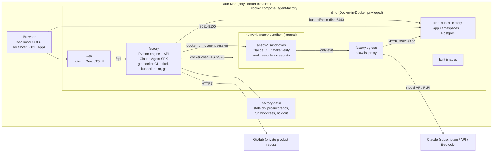
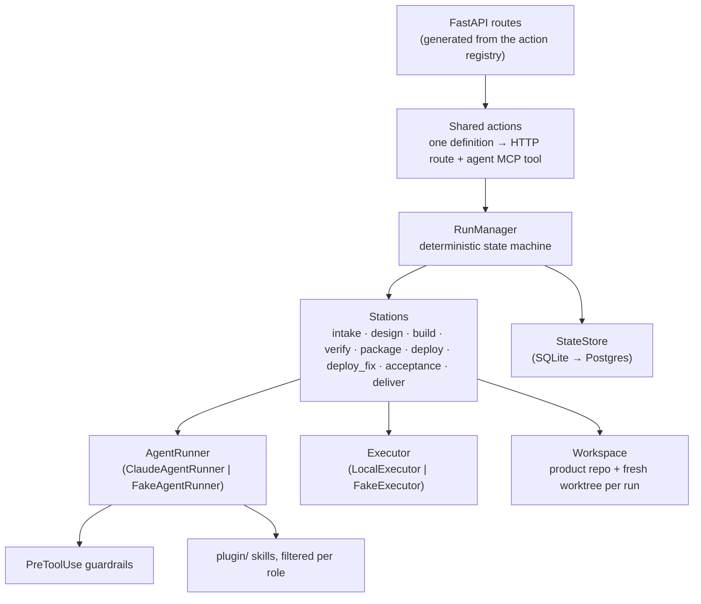

# Architecture

## Containers

Isolation properties:

- The factory container **never** mounts the host Docker socket. Everything it
  builds or runs lives inside `dind`: images, the kind cluster, and the app pods.
- The only host path mounted is `./.factory-data` (into the factory and dind at `/data`).
- Agents never run in the factory container: every agent session and every run of
  agent-written code gets a throw-away sandbox inside dind (ADR-0014).
  - It can write only the run worktree.
  - It gets no secrets, no Docker access and no cluster access.
  - Its network's only exit is an egress allowlist.
- Ports are bound to `127.0.0.1` only.
- The factory process runs as an unprivileged user. It starts as root only to
  copy the dind client certificates.

## Engine

### The run state machine

- Each station returns `passed | failed | needs_input | held | paused_limits`.
- `passed` moves to the station's `next`, or to the next forward station. After
  `deliver`, the run becomes **awaiting_feedback**: the feedback gate is open.
- `failed` moves to the station's `on_fail` route and hands over the failure
  **evidence** (command output, diagnostics, or observed behaviour).
  - If there is no route, the run is **held**.
  - Budgets: `max_attempts_per_station`, `max_loops_per_run` and
    `run_wall_clock_minutes`. Exhausting any budget means **held**, never a
    plausible success.
- `needs_input` happens when intake has a blocking question it cannot turn
  into an assumption. You answer in the UI, and the run continues.
- `paused_limits` happens when the SDK reports a rate-limit rejection. The run
  sleeps until the reset time, then continues. This is the `stay-within-limits`
  skill, enforced natively.
- **Restarts:** runs that were in flight are marked **interrupted** and wait for
  a human Resume (Builder's `factory-recover` rule). Set `policies.recover.mode:
  auto` to resume them automatically.

### Where artifacts live

| Artifact | Location | Visible to builder agents? |
|---|---|---|
| Spec, design, OpenAPI, tasks | `docs/` in the product repo | yes |
| Acceptance scenarios | `tests/acceptance/scenarios.yaml` | yes |
| Holdout scenarios | `.factory-data/holdout/<slug>/` | **no**: outside the worktree, and hooks deny it |
| Decision log | `events` table (append-only) | agents write to it via `log_decision` |
| Code | worktree `run/<id>` → merged to `main` → pushed | yes |

### Agent sessions

Each agent station opens a fresh Claude session with:

- the role prompt (`prompts/<role>.md`), the shared contract, and any
  `skill_prompts` overlays;
- the role's tool allowlist (`ROLE_TOOLS`);
- `permission_mode=acceptEdits`, plus the `PreToolUse` guardrails in
  `agents/hooks.py`: no `git push`, no destructive commands, no credentials,
  writes confined to the worktree, no holdout access, and an observe-only
  verifier;
- skills from `plugin/`, filtered per role through `role_skills`;
- the in-process MCP server `factory`, which exposes the `log_decision` action;
- structured output (a JSON schema) wherever the engine needs a machine-readable
  result. Intake produces the spec and scenarios; acceptance produces the verdict.

### Model routing (efficient-frontier)

| Tier | Default | Used by |
|---|---|---|
| judgment | `opus` | intake, design, acceptance |
| default | `sonnet` | build, deploy_fix |
| fast | `haiku` | sub-agents the developer delegates mechanical work to |

You can change any tier in `config.yaml`.
